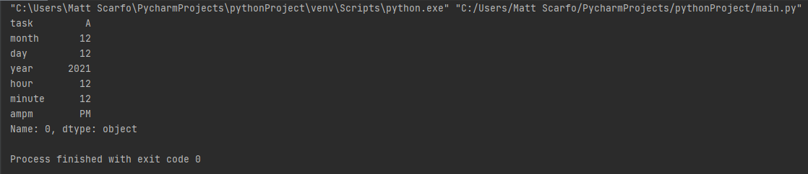

## Checklist GUI
Team: Sam Aba, Chandler Brooks, Heather Haynie, Matthew Scarfo

### Introduction
Our original idea of an eye-tracking game GUI was altered for various reasons. The goal for that project was to implement eye-tracking software into an interactive matching game, but we needed more materials other than the camera connected to the computer. We attempted to use various Python libraries; however, additional software/hardware, which was expensive, was required to successfully complete the design. 

Our updated design consists of an interactive checklist GUI that increases productivity and keeps the user organized. The interface allows the user to input daily/weekly/monthly/yearly tasks to organize his or her schedule. Once a task is completed, the GUI will display an encouraging message/meme to make the user feel accomplished. The GUI is a background process that is intended to be used every time the user is active. The main motivation behind this idea is that this program can be used by a wider variety of customers and can be heavily expanded upon. Our goal was to complete a working GUI that performs the previously listed abilities, and we were able to do so. Another goal for us was to use popular Python libraries that are well-known enough for outside contributors to expand on the idea. 

### Customer Value
Comparing the two designs, the checklist GUI has more realistic value for the customer's everyday life. As the original design intended to be a game which would only be used periodically and could lose value over time, the new design is meant to be used every day. We decided to go this updated route at the beginning of March, which did limit the functions we were able to successfully implement. However, our current design works as intended, and can be upgraded in various ways. Some possible ideas would be to implement a data tracker, which tracks website browsing data like existing applications to make a market off of the current design. Another possible upgrade would be a productivity tracker, which tracks keystrokes throughout the day to determine when the user is typically the most productive. One idea we had for the eye-tracking software which would also be useful for this design is a screentime manager, which monitors how long the user has been constantly staring at the screen to encourage taking a break to increase productivity. The idea could also be turned into a mobile application to increase its usefulness.

### Technology
Our code is powered through four main Python libraries: Tkinter, Pandas, Pickle, and Datetime. Tkinter is the backbone of the project which creates the GUI, the buttons, and the images produced when a task is completed. Pandas was used to convert the objects to proper types to be used in storing the data and saving it using Pickle. Once the data is saved, it can then be accessed the next time the user opens the program to pick up where they left off. Datetime was used to manage the alerts given when a deadline is approaching, and it organizes the dates input by the user. We have tested the software by adding a variety of tasks, removing the tasks, and closing/reopening the software to ensure the design is user-sustainable. 

The image above shows the command line when an item is added and saved to the checklist.

### Team
Although the original idea was from Heather, the current design was discussed and created by the entire team. Sam began our production by studying Tkinter and creating a basic GUI to support our project, which was expanded upon by the group. Heather studied Pandas and Pickle to create a save file and update the design to be more sustainable. The team member roles were mainly flexible. We began our production by meeting weekly, which transitioned to bi-weekly when lecture times allowed us to work on the project together. During our meetings, we would typically work individually, but ask questions to our teammates to guide through our design ideas and plan our future goals for implementation.

### Project Management
We did not complete our initial goals due to the design being changed, but our new design met most of its goals. One goal we wanted to successfully implement was the use of graphics in our design to add various designs which changed as the tasks were completed, such as a man climbing to the top of a mountain, a car reaching the finish line of a racetrack, or flowers blooming. However, it was difficult to find a solution to this with the code already produced, so we compromised with the memes/encouraging messages displayed when tasks were completed. We were also limited on time throughout the semester, as some of our team members are about to graduate and had other extensive classes taking up time throughout the week. Our design was meant to be a project that can be expanded upon and upgraded in a variety of ways.

###### Schedule:
| Week         | Task |
|--------------|-------------------------------------|
| Feb 8 - 12   | Finish proposal, research libraries |
| Feb 15 - 19  | Create rudimentary GUI |
| Feb 22 - 26  | Software development and implementation |
| Mar 1 - 5    | Submit status report 1 |
| Mar 8 - 12   | Implement checklist |
| Mar 15 - 19  | Submit status report 2 |
| Mar 22 - 26  | Work on final design and debug GUI |
| Mar 29 - April 2 | Submit status report 3 |
| April 2 - April 15 | Upgrade GUI with additional features |

### Reflection
Our team did a good job of meeting periodically and keeping everyone involved in the design. We had to compromise as the project design changed completely midway through the semester, but we did not let this hinder our success. Obviously, our original design did not go well. However, the checklist GUI works as intended and has real-world customer value. We typically were good at discussing our plans for the upcoming week so we had periodical goals to follow up on. The software development was not linear, but we took the necessary steps to prepare for the next steps in our design completion. Whenever a new commit was pushed, our team did a good job of testing to troubleshoot any problems in the GUI. We could have done better at managing the assignment of the next steps in the software development, as our production was good at times and stagnant at others. With all this being said, our design was a success, but could've been more of a success.
